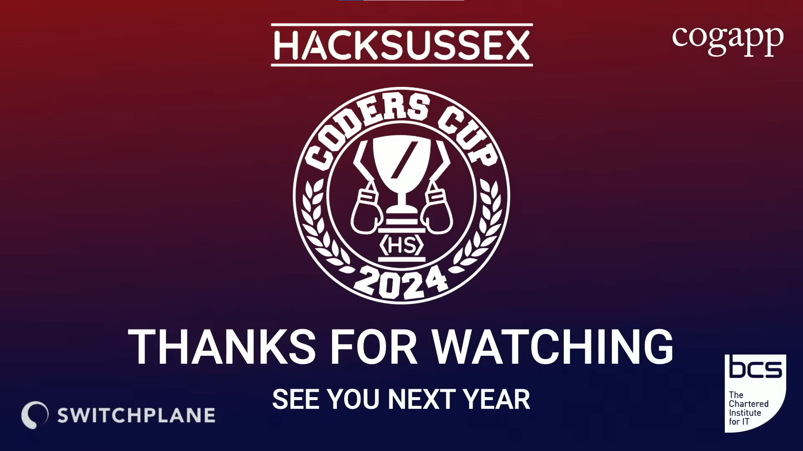

# About Code
## These are my solutions to problems that were in the [ HackSussex Coders' Cup 2024](https://youtu.be/VixYfv0UEyE).

# About HackSussex

## The Coders Cup is HackSussex's algorithmic coding competition for students! The live finals are where we place the top 8 of our qualifiers against each other to win the grand prizes! The competition is for undergraduate students to test their programming skills in a fun and exciting way whilst under the pressure of a live show.

## HackSussex runs an annual programming competition where all programmers studying at the University of Sussex compete to answer algorithmic coding puzzles. The first stage is a HackerRank competition where you can flex your knowledge of data structures and algorithms to answer as many questions as you can within a week! The next stage is a 8 player knockout competition where you will go toe to toe with other programmers, which will be streamed online. There is a prize pool involved for the winners of the competition.